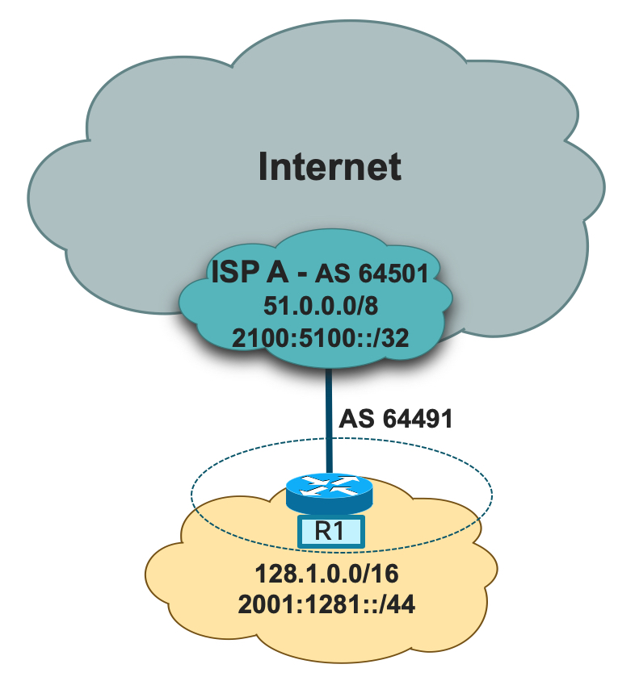
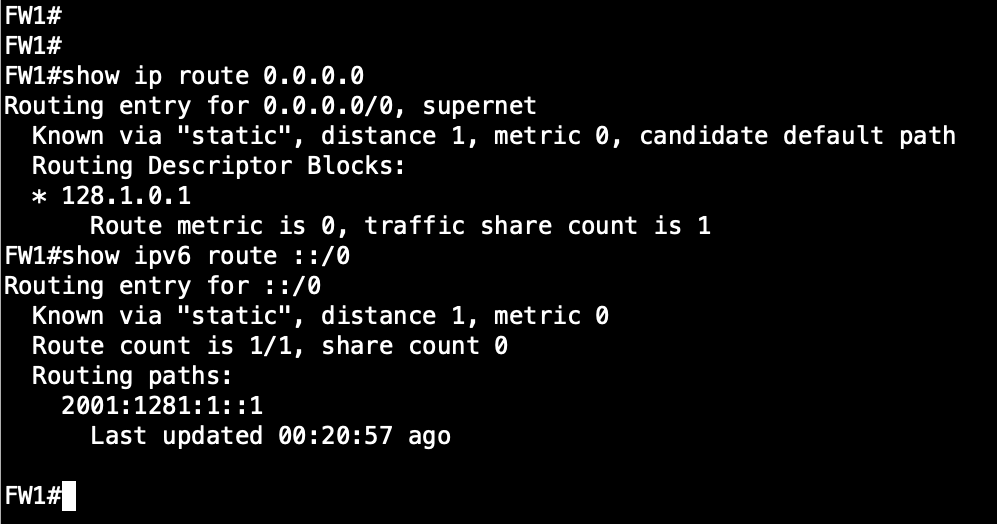
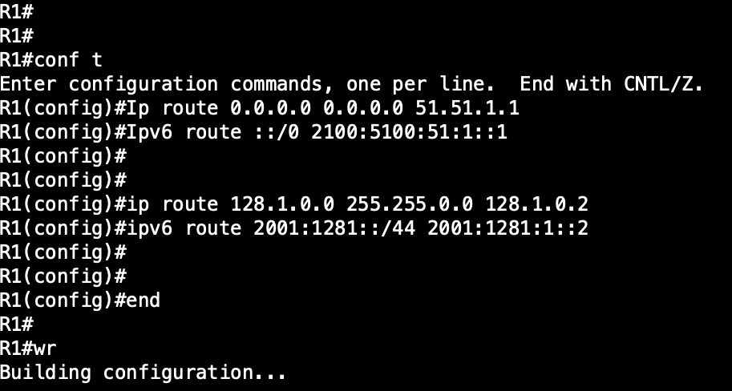
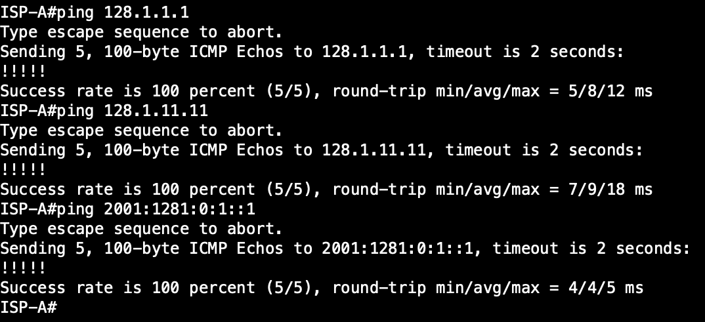
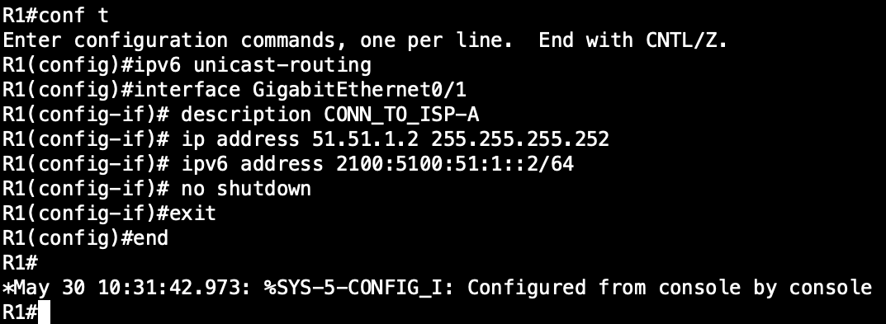
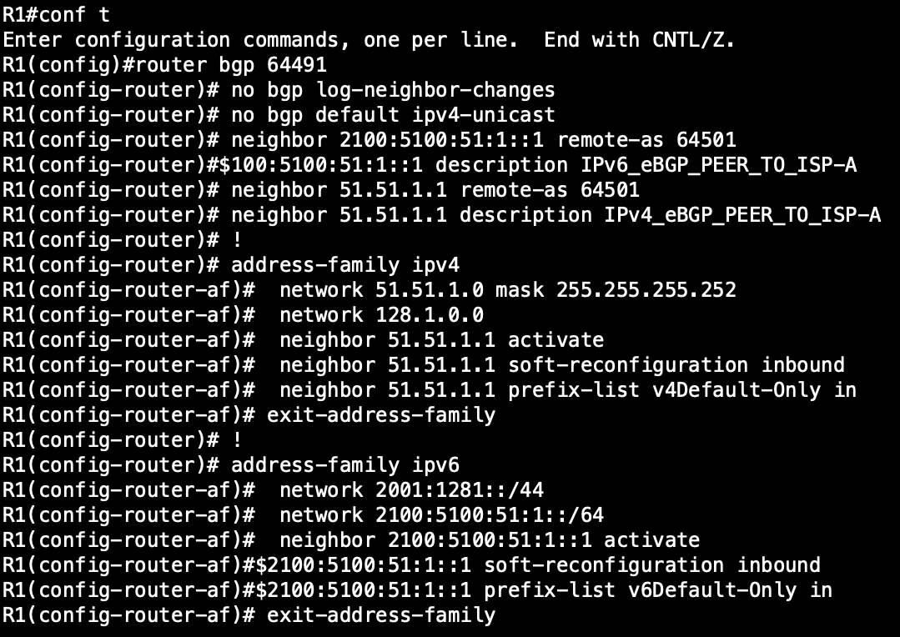
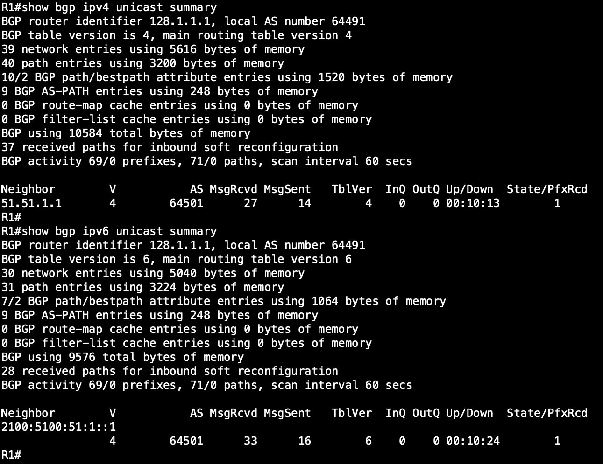
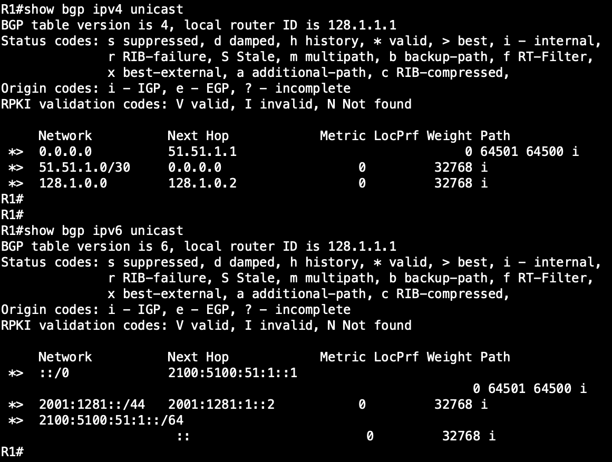
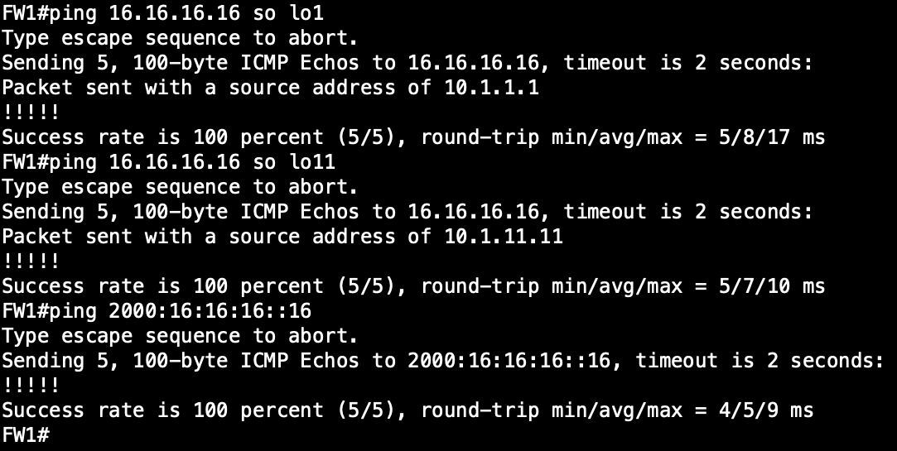

# CDS-1 Instructions

# My Contact information:
> Email:    michael.zsiga@gmail.com\
> Twitter:  https://twitter.com/michael_zsiga \
> LinkedIn: https://www.linkedin.com/in/zigzag \
> Website:  https://zigbits.tech \

This is Common Deployment Scenario (CDS) # 1 from the Cisco Live presentation BRKRST-2044 - Enterprise Multi-Homed Internet Edge Architectures. CDS 1 highlights the single router, single ISP connection deployment example.  Within this page are the steps to properly configure static (tragic) routing connectivity (Section 1) and dual stack BGP (IPv4/IPv6) connectivity (Section 2) to the Internet (INET).

NOTE: For all the Common Deployment Scenarios (CDS) you can load the initial configurations for BB1, BB2, ISP-A, and ISP-B once. We are not making a lot of changes to these devices, if any.

# CDS-1 Reference topology
Here is the CDS-1 Reference topology



# CDS-1 Section 1: Static (Tragic) solution
Make sure you have the initial configurations loaded on R1, FW1, BB1, BB2, and ISP-A. There should already be static (tragic) default routes on FW1 pointing to R1 for IPv4 and IPv6 respectively.



We need to add a static (tragic) default route for IPv4 and IPv6 on R1.

```
ip route 0.0.0.0 0.0.0.0 51.51.1.1
ipv6 route ::/0 2100:5100:51:1::1
```

We also need to add static (tragic) routes for R1's networks that FW1 owns.

```
ip route 128.1.0.0 255.255.0.0 128.1.0.2
ipv6 route 2001:1281::/44 2001:1281:1::2
```

Below is a screenshot of these static tragic routes being configured on R1.



Because we are not running a dynamic solution between R1 and ISP-A, ISP-A doesn't know how to get back to FW1. To solve this we need to add static tragic routes in ISP-A's configurations for R1's networks, 128.1.0.0/16 and 2001:1281::/44, pointing to R1's outside IP addresses.  We also need to add the corresponding network statements in BGP for CDS-1's networks so the rest of the world knows about them.

On ISP-A we need to add these static tragic routes:

```
ip route 128.1.0.0 255.255.0.0 51.51.1.2
ipv6 route 2001:1281::/44 2100:5100:51:1::2
```

Here is a screenshot of these routes being configured on ISP-A:


Here is a screenshot of R1's networks being added to ISP-A's BGP configuration:


Now we must complete our verification and testing phase of our solution.  From an ingress perspective, we should be able to ping from ISP-A to our FW1 IPv4 and IPv6 addresses: 128.1.1.1, 128.1.11.11 (Hosted Content), and 2001:1281:0:1::1 respectively.  Here is a screenshot showing this verification step for our ingress policy:



Now that we validated our Ingress policy we need to validate our Egress policy from FW1. On FW1 we want to test connectivity to the Internet addresses 16.16.16.16 and 2000:16:16:16::16 respectively.


# CDS-1 Section 2: Dual Stack BGP Solution

If you were following along above for CDS-1 Section 1, you will want to make sure you have the initial configurations loaded on R1, FW1, BB1, BB2, and ISP-A again.  Keep in mind that we didn't make any changes to BB1 or BB2 in Section 1.

Now that we have our initial configurations loaded on these devices, its time to level set on what our goal is for this section. We have two goals for section 2.  Number one is to establish a baseline understanding of the BGP configuration and syntax needed to standup a BGP IPv4/IPv6 dual stack ISP peering connection.  Number two is to actually standup our BGP IPv4/IPv6 dual stack design and properly verify our ingress and egress policies.

To start with, we need to enable IPv6 unicast routing and then configure our interface towards ISP-A with IPv4 and IPv6 addresses. These are included in the initial configurations of R1 but are shown below for clarity.

```
ipv6 unicast-routing

interface GigabitEthernet0/1
 description CONN_TO_ISP-A
 ip address 51.51.1.2 255.255.255.252
 ipv6 address 2100:5100:51:1::2/64
 no shutdown
```

Below is a screenshot of these configurations being applied on R1.



## Won't you be my Neighbor?

Now that we have our IP addresses configured on R1 towards ISP-A, we need to configure R1's BGP neighbors with ISP-A. Our ASN for R1 is 64491.  When I am configuring BGP with multiple address families I prefer to disable the default IPv4 unicast address family with the command 'no bgp default ipv4-unicast' in the global BGP configuration. We configure neighbors under the BGP <ASN> process as shown below.

```
router bgp 64491
 no bgp default ipv4-unicast
 neighbor 2100:5100:51:1::1 remote-as 64501
 neighbor 51.51.1.1 remote-as 64501
```

Then we activate each neighbor under the respective address family.

```
address-family ipv4
 neighbor 51.51.1.1 activate
exit-address-family
!
address-family ipv6
 neighbor 2100:5100:51:1::1 activate
exit-address-family
```

We now specify R1's address prefixes that we want to announce to our neighbors.

```
address-family ipv4
 neighbor 51.51.1.1 activate
 network 128.1.0.0
exit-address-family
!
address-family ipv6
 neighbor 2100:5100:51:1::1 activate
 network 2001:1281::/44
exit-address-family
```

Now we are going to apply a simple policy to show how to configure it.  For this example we only want to allow the default route in for both IPv4 and IPv6.  To do this we are going to create prefix-lists and then apply them in the corresponding BGP address family.  In the initial configuration for R1, we have already defined the below two prefixes that we will be using for this example.

```
ip prefix-list v4Default-Only description ALLOW_ONLY_v4DEFAULT_ROUTE
ip prefix-list v4Default-Only seq 5 permit 0.0.0.0/0
ipv6 prefix-list v6Default-Only description ALLOW_ONLY_v6DEFAULT_ROUTE
ipv6 prefix-list v6Default-Only seq 5 permit ::/0
```

With these prefixes defined, we can now apply them within the respecive address family as shown below.

```
address-family ipv4
 neighbor 51.51.1.1 prefix-list v4Default-Only in
exit-address-family
!
address-family ipv6
 neighbor 2100:5100:51:1::1 prefix-list v6Default-Only in
exit-address-family
```

Now when we put all of these steps together, we get a BGP configuration that looks like this.

```
router bgp 64491
 no bgp log-neighbor-changes
 no bgp default ipv4-unicast
 neighbor 2100:5100:51:1::1 remote-as 64501
 neighbor 2100:5100:51:1::1 description IPv6_eBGP_PEER_TO_ISP-A
 neighbor 51.51.1.1 remote-as 64501
 neighbor 51.51.1.1 description IPv4_eBGP_PEER_TO_ISP-A
 !
 address-family ipv4
  network 51.51.1.0 mask 255.255.255.252
  network 128.1.0.0
  neighbor 51.51.1.1 activate
  neighbor 51.51.1.1 soft-reconfiguration inbound
  neighbor 51.51.1.1 prefix-list v4Default-Only in
 exit-address-family
 !
 address-family ipv6
  network 2001:1281::/44
  network 2100:5100:51:1::/64
  neighbor 2100:5100:51:1::1 activate
  neighbor 2100:5100:51:1::1 soft-reconfiguration inbound
  neighbor 2100:5100:51:1::1 prefix-list v6Default-Only in
 exit-address-family
```

Here is a screenshot of this entire BGP configuration being applied on R1.



With our BGP configuration implemented, there is still something we must do before we can entire the verification phase.  In this design, there isn't an IGP between R1 and FW1.  We are leveraging static tragic routes instead.  Because of this, we need to tell R1 to go to FW1 for 128.1.0.0/16 and 2001:1281::/44 respectively.  

NOTE: I am not a fan of static "tragic" routes as I'm sure most of you can tell, but for this deployment scenario I find most real world "in the wild" implementation use them more than a true IGP.

We are going to add the following static routes to R1's configuration.

```
ip route 128.1.0.0 255.255.0.0 128.1.0.2
ipv6 route 2001:1281::/44 2001:1281:1::2
```

Here is a screenshot showing these changes.


## Verification Time

Now that we have our policy implemented, we need to verify it actually works as expected. First we will want to verify our BGP Neighbors are actually active, then we will want to check we are receiving the default routes like we should.  Finally, we will want to test connectivity to hosts on the internet.

To check our BGP neighbors we are going top use the commands "show bgp ipv4 unicast summary" and "show bgp ipv6 unicast summary".

```
show bgp ipv4 unicast summary
show bgp ipv6 unicast summary
```

Here is a screenshot of what an active neighbor should look like.



Let's check to see if we are receiving the default routes like we should be. To do this we are going to use a similar command as in the last step: "show bgp ipv4 unicast" and "show bgp ipv6 unicast"

```
show bgp ipv4 unicast
show bgp ipv6 unicast
```



FW1 is our host in this example with different loopback addresses (loopback1 and loopback11) for IPv4 because the FW is running Network Address Translation (NAT), for IPv4 only.  When we ping from FW1, we are testing our egress policy.

```
ping 16.16.16.16 so lo1
ping 16.16.16.16 so lo11

ping 2000:16:16:16::16
```

Here is a screenshot showing our egress policy verification:



Now if CDS-1 was hosting content, we would want to test connectivity from the internet. For our example FW1 is doing a static nat (IPv4 only) to simulate a hosted server within CDS-1. To test this ingress connectivity, we will ping this server from BB1.

```
ping 128.1.11.11
ping 2001:1281:0:11::11
```

Here is a screenshot showing our ingress policy verification:


