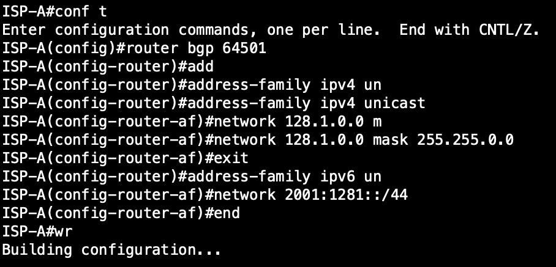

# CDS-1 README

> Contact information:\
> Email:    michael.zsiga@gmail.com\
> Twitter:  https://twitter.com/michael_zsiga\
> LinkedIn: https://www.linkedin.com/in/zigzag\
> Website:  https://zigbits.tech\

# CDS-1 Overview
This is Common Deployment Scenario (CDS) # 1 from the Cisco Live presentation BRKRST-2044 - Enterprise Multi-Homed Internet Edge Architectures. CDS 1 highlights the single router, single ISP connection deployment example.  Within this page are the steps to properly configure static (tragic) routing connectivity (Section 1) and dual stack BGP (IPv4/IPv6) connectivity (Section 2) to the Internet (INET). 

NOTE: For all the Common Deployment Scenarios (CDS) you can load the initial configurations for BB1, BB2, ISP-A, and ISP-B once. We are not making a lot of changes to these devices, if any.

# CDS-1 Reference topology
Here is the CDS-1 Reference topology

# CDS-1 Section 1: Static (Tragic) solution
Make sure you have the initial configurations loaded on R1, FW1, BB1, BB2, and ISP-A. There should already be static (tragic) default routes on FW1 pointing to R1 for IPv4 and IPv6 respectively.

We need to add a static (tragic) default route for IPv4 and IPv6 on R1.

	ip route 0.0.0.0 0.0.0.0 51.51.1.1
	ipv6 route ::/0 2100:5100:51:1::1

We also need to add static (tragic) routes for R1's networks that FW1 owns.

	ip route 128.1.0.0 255.255.0.0 128.1.0.2
	ipv6 route 2001:1281::/44 2001:1281:1::2

Below is a screenshot of these static tragic routes being configured on R1.

Because we are not running a dynamic solution between R1 and ISP-A, ISP-A doesn't know how to get back to FW1. To solve this we need to add static tragic routes in ISP-A's configurations for R1's networks, 128.1.0.0/16 and 2001:1281::/44, pointing to R1's outside IP addresses.  We also need to add the corresponding network statements in BGP for CDS-1's networks so the rest of the world knows about them.

On ISP-A we need to add these static tragic routes:

	ip route 128.1.0.0 255.255.0.0 51.51.1.2
	ipv6 route 2001:1281::/44 2100:5100:51:1::2

Here is a screenshot of these routes being configured on ISP-A:

Here is a screenshot of R1's networks being added to ISP-A's BGP configuration:

Now we must complete our verification and testing phase of our solution.  From an ingress perspective, we should be able to ping from ISP-A to our FW1 IPv4 and IPv6 addresses: 128.1.1.1, 128.1.11.11 (Hosted Content), and 2001:1281:0:1::1 respectively.  Here is a screenshot showing this verification step for our ingress policy:

Now that we validated our Ingress policy we need to validate our Egress policy from FW1. On FW1 we want to test connectivity to the Internet address 16.16.16.16 and 2000:16:16:16::16 respectively.

# CDS-1 Section 2: Dual Stack BGP Solution

