# CDS-3 Instructions

My Contact information:
> Email:    michael.zsiga@gmail.com\
> Twitter:  https://twitter.com/zig_zsiga \
> LinkedIn: https://www.linkedin.com/in/zigzag \
> Website:  https://zigbits.tech

This is Common Deployment Scenario (CDS) # 3 from the Cisco Live presentation BRKRST-2044 - Enterprise Multi-Homed Internet Edge Architectures. CDS-3 highlights the dual router, dual ISP connections deployment example. Within this page are the steps to properly configure BGP Active / Active routing connectivity to the Internet (INET).  There are three option we are going to cover:

- Option 1 - Firewall and FHRP (Section 1)
- Option 2 - ECMP on Firewall (Section 2)
- Option 3 - Intermediate ECMP on L3 Switch (Section 3)

NOTE: For all the Common Deployment Scenarios (CDS) you can load the initial configurations for BB1, BB2, ISP-A, and ISP-B once. We are not making a lot of changes to these devices, if any.

# CDS-3 Reference topology
Here is the CDS-3 Reference topology

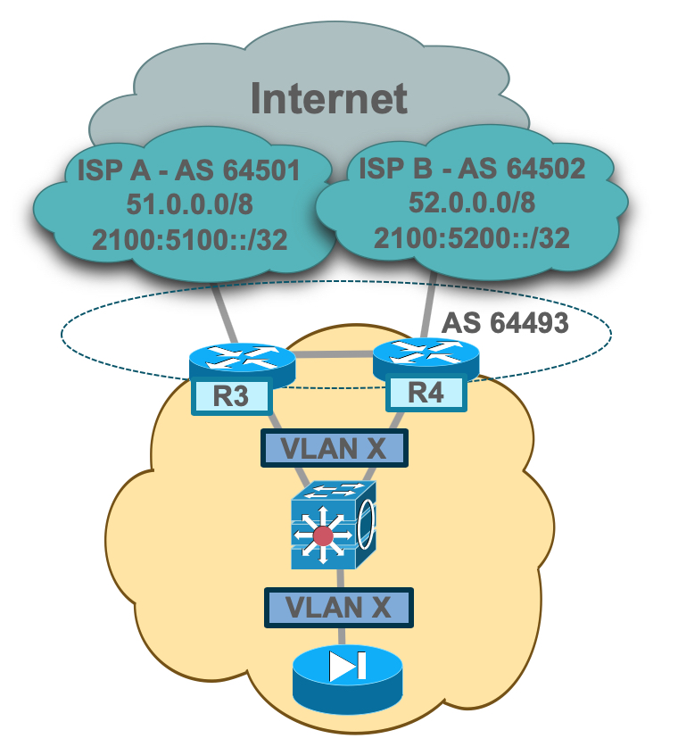

NOTE: Make sure you have the initial configurations loaded for R3, R4, SW1, and FW3 before starting each section below.

# CDS-3 Section 1: Firewall and First Hop Redundancy Protocol

For our policy in this CDS, we are going to build an Active / Active configuration.  The Edge Routers R3 and R4 already have BGP configured and their corresponding ISP connections are running. From a policy perspective we are allowing CDS-3 networks outbound and then allowing the default routes in. For this section, our edge routers are going to be running Hot Standby Router Protocol (HSRP) for both IPv4 and IPv6. SW1 is going to be acting as a layer 2 switch (think of a stackable switch). Our firewall, FW3, will be utilizing static tragic default routes to the two different HSRP Groups we are going to configure.

Our first task here is to configure our shared subnet between R3, R4, SW1, and FW3.  For this section, our shared subnet will be 128.3.1.0/24 and 2001:1283::/64 for IPv4 and IPv6 respectively.  Here is the breakdown of what each IP address will be used for:

- 128.3.1.0/24
  - 128.3.1.1/24 - HSRP Group 1 VIP address
  - 128.3.1.2/24 - HSRP Group 2 VIP address
  - 128.3.1.3/24 - R3's internal
  - 128.3.1.4/24 - R4's internal
  - 128.3.1.5/24 - FW3's outside addresses    

- 2001:1283::/64
  - 2001:1283::1/64 - HSRP Group 1 VIP address
  - 2001:1283::2/64 - HSRP Group 2 VIP address
  - 2001:1283::3/64 - R3's internal
  - 2001:1283::4/64 - R4's internal
  - 2001:1283::5/64 - FW3's internal


```
R3:
interface GigabitEthernet0/3
 description CONN_TO_SW1
 ip address 128.3.1.3 255.255.255.0
 ipv6 address 2001:1283::3/64

R4:
interface GigabitEthernet0/3
 description CONN_TO_SW1
 ip address 128.3.1.4 255.255.255.0
 ipv6 address 2001:1283::4/64

FW3:
interface GigabitEthernet0/1
 description CONN_TO_SW1
 ip address 128.3.1.5 255.255.255.0
 ipv6 address 2001:1283::5/64

SW1:
vlan 100
 name CDS-3

interface range g0/1-3
 switchport mode access
 switchport access vlan 100

```

Now that we have our little network configured here, we need to configure HSRP.  Here is how we are going to configure HSRP with four groups (two per address family) on both R3 and R4.

```
R3:
interface GigabitEthernet0/3
 standby version 2
 standby 1 ip 128.3.1.1
 standby 1 priority 150
 standby 1 preempt
 standby 2 ip 128.3.1.2
 standby 2 preempt
 standby 3 ipv6 2001:1283::1/64
 standby 3 priority 150
 standby 3 preempt
 standby 4 ipv6 2001:1283::2/64
 standby 4 preempt

 R4:
 interface GigabitEthernet0/3
  standby version 2
  standby 1 ip 128.3.1.1
  standby 1 preempt
  standby 2 ip 128.3.1.2
  standby 2 priority 150
  standby 2 preempt
  standby 3 ipv6 2001:1283::1/64
  standby 3 preempt
  standby 4 ipv6 2001:1283::2/64
  standby 4 priority 150
  standby 4 preempt

```

With HSRP configured, we are going to use the show command "show standby" to verify our configuration:

```
show standby gigabitEthernet 0/3 1 brief
show standby gigabitEthernet 0/3 2 brief
show standby gigabitEthernet 0/3 3 brief
show standby gigabitEthernet 0/3 4 brief
```

Here is a screenshot of these show commands on R3:

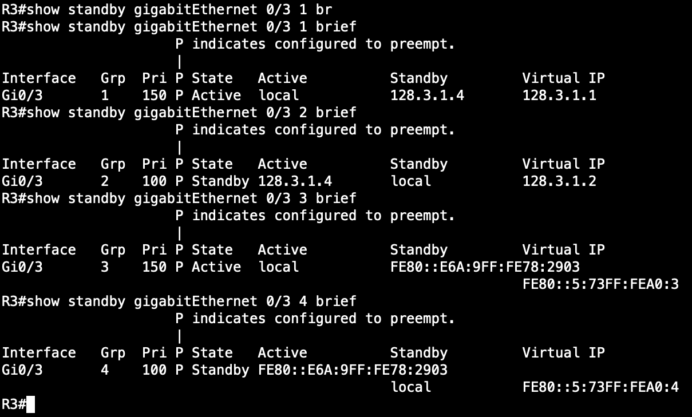

Configure static routes on each edge router, R3 and R4, pointing back to FW4.

```
ip route 128.3.0.0 255.255.0.0 128.3.1.5
ipv6 route 2001:1283::/44 2001:1283::5
```


Now, because we do not have administrative control over the firewall in this situation, we need to have our security team add the corresponding default static tragic routes on their firewall pointing to the HSRP VIP addresses.  Here is what you should configure on FW3.

```
ip route 0.0.0.0 0.0.0.0 128.3.1.1
ip route 0.0.0.0 0.0.0.0 128.3.1.2
ipv6 route ::/0 2001:1283::2
ipv6 route ::/0 2001:1283::1
```


## Verification

For our verification in this section, we are going to leverage ping to make sure our connectivity is good to go.  From our FW3 we are going to ping the external addresses 16.16.16.16 and 2000:16:16:16::16. For IPv4 we are going to source our pings from Loopback3 because we are NATing on our Firewall. Then from BB1 we are going to ping our own addresses of 128.3.33.33 and 2001:1283:0:33::33.

```
ping 16.16.16.16 so lo3
ping 2000:16:16:16::16

ping 128.3.33.33
ping 2001:1283:0:33::33
```
Below are screenshots showing our successful verification for our Egress and Ingress connectivity.

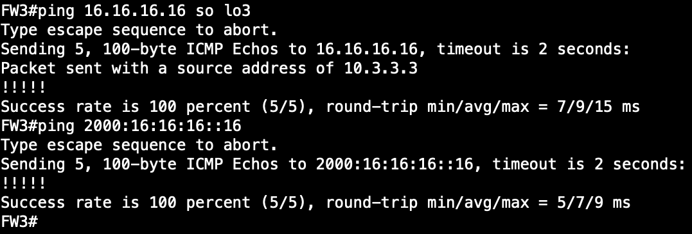


# CDS-3 Section 2: Equal-Cost Multipath (ECMP) on Firewall

For this section we assume administrative control over the Firewall FW3. Because we have administrative control over FW3, we can run an IGP between our edge routers R3 and R4 and FW3. SW1 is still just a layer 2 switch with no layer 3 functionality configured. To help with our Egress and Ingress policy, we will be redistributing between BGP and the IGP on our edge routers R3 and R4.

From the initial configuration, we have our BGP neighborships up and running between R3 and ISP-A, and R4 and ISP-B.  We are receiving the default routes from both providers and are advertising our CDS-3 range outbound. We can tweak this policy anyway we would like, from what we did in CDS-1 and CDS-2, but for now we need to properly show how to pass these routes between the edge routers R3 and R4, and the Firewall, FW3.

Our first task is to configure our IP addresses between the edge routers and firewall. We are going to use a shared subnet between R3, R4, SW1, and FW3.  Our shared subnet will be 128.3.1.0/24 and 2001:1283::/64 for IPv4 and IPv6 respectively.  We also need to create a VLAN on SW1 to allow connectivity between the devices on this subnet.  Here is the breakdown of what each IP address will be used for:

- 128.3.1.0/24
  - 128.3.1.3/24 - R3's internal
  - 128.3.1.4/24 - R4's internal
  - 128.3.1.5/24 - FW3's outside addresses    

- 2001:1283::/64
  - 2001:1283::3/64 - R3's internal
  - 2001:1283::4/64 - R4's internal
  - 2001:1283::5/64 - FW3's internal

```
R3:
interface GigabitEthernet0/3
 description CONN_TO_SW1
 ip address 128.3.1.3 255.255.255.0
 ipv6 address 2001:1283::3/64

R4:
interface GigabitEthernet0/3
 description CONN_TO_SW1
 ip address 128.3.1.4 255.255.255.0
 ipv6 address 2001:1283::4/64

FW3:
interface GigabitEthernet0/1
 description CONN_TO_SW1
 ip address 128.3.1.5 255.255.255.0
 ipv6 address 2001:1283::5/64

SW1:
vlan 100
 name CDS-3

interface range g0/1-3
 switchport mode access
 switchport access vlan 100

```

Our next step is to configure our IGP, in this case we are going to do EIGRP and we are going to configure IPv4 and IPv6 separately.

```
R3:
router eigrp 10
 network 128.3.1.0 0.0.0.255
 passive-interface default
 no passive-interface GigabitEthernet0/3
 eigrp router-id 128.3.3.3

ipv6 router eigrp 100
 passive-interface default
 no passive-interface GigabitEthernet0/3

interface GigabitEthernet0/3
 ipv6 eigrp 100


R4:
router eigrp 10
 network 128.3.1.0 0.0.0.255
 passive-interface default
 no passive-interface GigabitEthernet0/3
 eigrp router-id 128.3.4.4

ipv6 router eigrp 100
 passive-interface default
 no passive-interface GigabitEthernet0/3

interface GigabitEthernet0/3
 ipv6 eigrp 100


FW3:
router eigrp 10
 network 128.3.1.0 0.0.0.255
 passive-interface default
 no passive-interface GigabitEthernet0/1
 eigrp router-id 128.3.1.5

ipv6 router eigrp 100
 passive-interface default
 no passive-interface GigabitEthernet0/1

interface GigabitEthernet0/1
 ipv6 eigrp 100
```

Here are the screenshots showing these IGP configurations being applied on the respective devices:

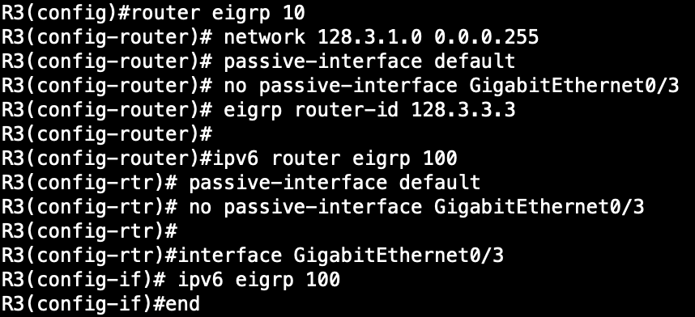

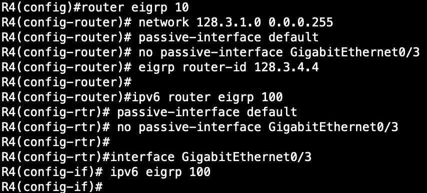

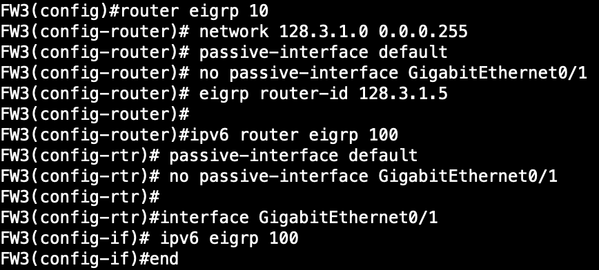

We can validate our EIGRP neighborships are online by issuing the following commands on each device:

```
show ip eigrp neighbors
show ipv6 eigrp neighbor
```

Now we need to inject the default route from BGP on the edge routers R3 and R4 into EIGRP. We are going to accomplish this by utilizing the following prefix-lists and route-maps when we redistribute from BGP into EIGRP.

```
ip prefix-list v4Default-Only description ALLOW_ONLY_v4DEFAULT_ROUTE
ip prefix-list v4Default-Only seq 5 permit 0.0.0.0/0
ipv6 prefix-list v6Default-Only description ALLOW_ONLY_v6DEFAULT_ROUTE
ipv6 prefix-list v6Default-Only seq 5 permit ::/0

route-map IPv6_BGP->EIGRP permit 10
 match ip address prefix-list v6Default-Only
route-map IPv4_BGP->EIGRP permit 10
 match ip address prefix-list v4Default-Only
```

These prefix-lists and route-maps are already pre-configured on the devices.

Now all we need to do is add the corresponding redistribution statement in our EIGRP processes.

```
router eigrp 10
 redistribute bgp 64493 metric 100 1000 1 255 1500 route-map IPv4_BGP->EIGRP

ipv6 router eigrp 100
 redistribute bgp 64493 metric 100 1000 1 255 1500 route-map IPv6_BGP->EIGRP
```
Here are screenshots showing these redistributions being configured on both R3 and R4.


Now we can validate the default route is properly being injected into the corresponding EIGRP topology table by issuing the following commands on each device.

```
show ip ei top
show ipv6 ei top
```

Here is a screenshot showing these commands on just R3.  The output would be similiar are R4.

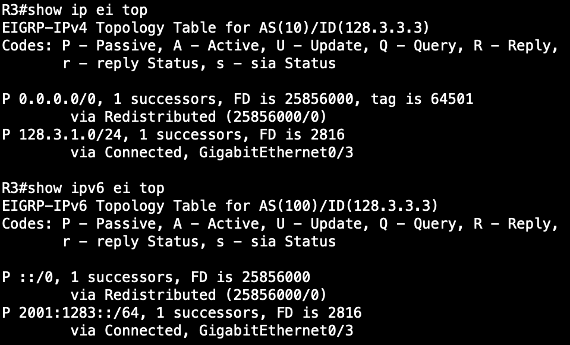

We have our Egress policy configured now and we will fully test it in a few minutes, but we need to finish configuring our Ingress policy.  Our Edge Routers are properly advertising CDS-3's range outbound but the range doesn't exist in the RIB on R3 or R4 currently.  We need to resolve this and there are a number of options to do this.  I prefer to advertise the network in EIGRP on the Firewall, FW3. We will accomplish this via an EIGRP Summary statement for both IPv4 and IPv6.

On FW3 we will need to add the following statements:

```
interface GigabitEthernet0/1
 ip summary-address eigrp 10 128.3.0.0 255.255.0.0
 ipv6 summary-address eigrp 100 2001:1283::/44
```


We can check that these summary statements are working by looking in the respective EIGRP topology table:

```
show ip ei top
show ipv6 ei top
```

## Verify connectivity

Final step! Lets verify what we wanted to do is working properly. Once again we are going to leverage ping to make sure our connectivity is good to go. From our FW3 we are going to ping the external addresses 16.16.16.16 and 2000:16:16:16::16. For IPv4 we are going to source our pings from Loopback3 because we are NATing on our Firewall. Then from BB1 we are going to ping our own addresses of 128.3.33.33 and 2001:1283:0:33::33.

```
ping 16.16.16.16 so lo3
ping 2000:16:16:16::16

ping 128.3.33.33
ping 2001:1283:0:33::33
```
Below are screenshots showing our successful verification for our Egress and Ingress connectivity.


# CDS-3 Section 3: Intermediate Equal-Cost Multipath (ECMP) on L3 Switch

For this section, we once again lose administrative control over the Firewall, FW3.  Now the security team owns and manages the firewall.  Because we are not fans of static tragic routes, we decide to upgrade our layer 2 switch to a layer 3 switch and run an IGP between our edge routers, R3 and R4, and our newly upgrade layer 3 switch, SW1.  Of course on FW3, there will need to be some nasty default static tragic routes that our security team will need to add.

Our initial configurations once again setup an Active / Active BGP configuration with R3 and R4 connecting to ISP-A and ISP-B respectively.  Our current BGP policies are only advertising our networks outbound and only allowing the default route in.  Of course you can tweak these if you would like to replicate anything in CDS-1, CDS-2, and what you have seen so far in CDS-3.  We are going to keep with our Active / Active configuration.  

Our first task is to configure our IP addresses and subnets between R3, R4, SW1, and FW3.  This section is going to be different than CDS-3 section 1 and 2 because now our SW1 is routing and is no longer a layer 2 switch to get to FW3.  Because of this, we are going to use different IPv4 /30 and IPv6 /64 networks as mock point to point networks.  Here is how they are going to be configured.

- 128.3.0.0/30:
  - R3:  .1
  - SW1: .2
- 128.3.0.8/30:
  - R4:  .9
  - SW1: .10
- 128.3.0.12/30:
  - SW1: .13
  - FW3: .14

- 2001:1283:3::/64
  - R3:  ::1
  - SW1: ::2
- 2001:1283:4::/64
  - R4:  ::1
  - SW1: ::2
- 2001:1283:5::/64
  - SW1: ::1
  - FW3: ::2

```
R3:
interface GigabitEthernet0/3
 ip address 128.3.0.1 255.255.255.252
 ipv6 address 2001:1283:3::1/64

R4:
interface GigabitEthernet0/3
 ip address 128.3.0.9 255.255.255.252
 ipv6 address 2001:1283:4::1/64

FW3:
interface GigabitEthernet0/1
 ip address 128.3.0.14 255.255.255.252
 ipv6 address 2001:1283:5::2/64

SW1:
interface GigabitEthernet0/1
 no switchport
 ip address 128.3.0.2 255.255.255.252
 ipv6 address 2001:1283:3::2/64

interface GigabitEthernet0/2
 no switchport
 ip address 128.3.0.10 255.255.255.252
 ipv6 address 2001:1283:4::2/64

interface GigabitEthernet0/3
 no switchport
 ip address 128.3.0.13 255.255.255.252
 ipv6 address 2001:1283:5::1/64
```

Now we need to configure our IGP and we will use EIGRP again here.

```
R3:
router eigrp 10
 network 128.3.0.1 0.0.0.0
 passive-interface default
 no passive-interface GigabitEthernet0/3
 eigrp router-id 128.3.3.3

ipv6 router eigrp 100
 passive-interface default
 no passive-interface GigabitEthernet0/3

interface GigabitEthernet0/3
 ipv6 eigrp 100

R4:
router eigrp 10
 network 128.3.0.9 0.0.0.0
 passive-interface default
 no passive-interface GigabitEthernet0/3
 eigrp router-id 128.3.4.4

ipv6 router eigrp 100
 passive-interface default
 no passive-interface GigabitEthernet0/3

interface GigabitEthernet0/3
 ipv6 eigrp 100

SW1:
router eigrp 10
 network 128.3.0.2 0.0.0.0
 network 128.3.0.10 0.0.0.0
 network 128.3.0.13 0.0.0.0
 passive-interface default
 no passive-interface GigabitEthernet0/1
 no passive-interface GigabitEthernet0/2

ipv6 router eigrp 100
 passive-interface default
 no passive-interface GigabitEthernet0/1
 no passive-interface GigabitEthernet0/2

interface GigabitEthernet0/1
 ipv6 eigrp 100

interface GigabitEthernet0/2
 ipv6 eigrp 100
```

Here are screenshots showing EIGRP being configured on R3, R4, and SW1:

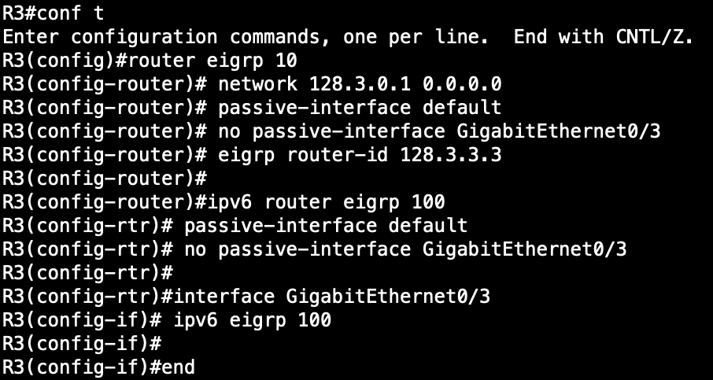

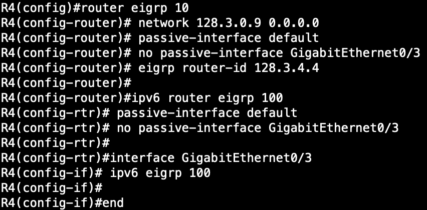

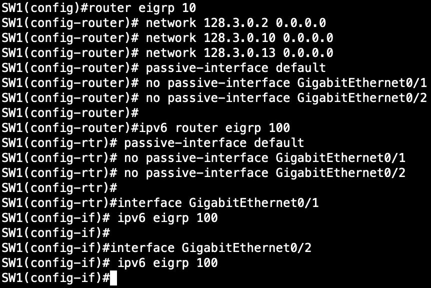

Our next task is to get the default routes from R3's and R4's BGP table into EIGRP. To accomplish this we are just going to do the same redistribution with the same prefix-lists and route-maps from section 2 above.  Here they all are for reference.

```
ip prefix-list v4Default-Only description ALLOW_ONLY_v4DEFAULT_ROUTE
ip prefix-list v4Default-Only seq 5 permit 0.0.0.0/0
ipv6 prefix-list v6Default-Only description ALLOW_ONLY_v6DEFAULT_ROUTE
ipv6 prefix-list v6Default-Only seq 5 permit ::/0

route-map IPv6_BGP->EIGRP permit 10
 match ip address prefix-list v6Default-Only
route-map IPv4_BGP->EIGRP permit 10
 match ip address prefix-list v4Default-Only
```

These prefix-lists and route-maps are already pre-configured on the devices.

Now all we need to do is add the corresponding redistribution statement in our EIGRP processes.

```
router eigrp 10
 redistribute bgp 64493 metric 100 1000 1 255 1500 route-map IPv4_BGP->EIGRP

ipv6 router eigrp 100
 redistribute bgp 64493 metric 100 1000 1 255 1500 route-map IPv6_BGP->EIGRP
```

No screenshots this time as they are the same as in section 2.  Make sure to check your EIGRP topology tables for the default routes with the below commands:

```
show ip ei top
show ipv6 ei top
```

The final step for our Egress policy is to make sure the security team puts the following default static tragic routes on FW3:

```
ip route 0.0.0.0 0.0.0.0 128.3.0.13
ipv6 route ::/0 2001:1283:5::1
```


Thats it for our Egress policy, now to finish our Ingress policy. In section 2 we advertised our networks from FW3 but in this section we do not have admin control over FW3.  FW3 still owns these networks, so we sadly are going to have to add static tragic routes for these networks on SW1 pointing to FW3's outside interface.  We then are going to inject these static routes into EIGRP.  To make this a little easier, we are going to create route-maps that match on a tag value, 10 for IPv4 and 100 for IPv6.  Below are the route-maps, the static routes, and the EIGRP redistribution statement:

```
route-map IPv6_STATIC->EIGRP permit 10
 match tag 100
route-map IPv4_STATIC->EIGRP permit 10
 match tag 10

ip route 128.3.0.0 255.255.0.0 128.3.0.14 tag 10
ip route 128.3.0.0 255.255.128.0 128.3.0.14 tag 10
ip route 128.3.128.0 255.255.128.0 128.3.0.14 tag 10

ipv6 route 2001:1283::/44 2001:1283:5::2 tag 100

router eigrp 10
 redistribute static metric 10000 10 255 1 1500 route-map IPv4_STATIC->EIGRP

ipv6 router eigrp 100
 redistribute static metric 10000 10 255 1 1500 route-map IPv6_STATIC->EIGRP

```

And here are screenshots with the final ingress policy configurations on SW1:

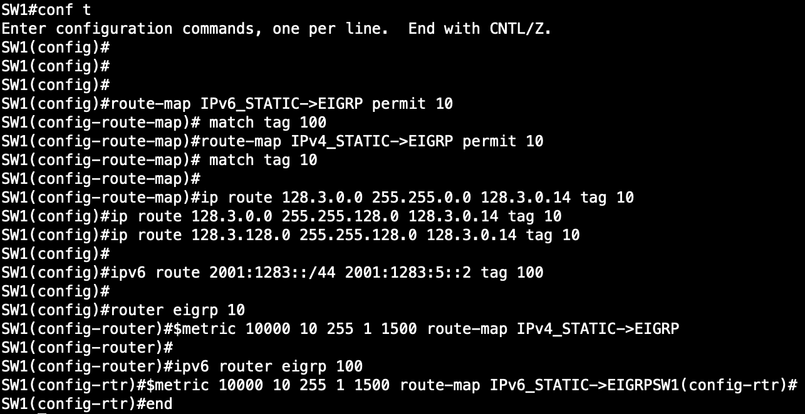

## Verification

Verification time!!  We are going to use ping to verify we have the proper connectivity we should have. From our FW3 we are going to ping the external addresses 16.16.16.16 and 2000:16:16:16::16. For IPv4 we are going to source our pings from Loopback3 because we are NATing on our Firewall. Then from BB1 we are going to ping our own addresses of 128.3.33.33 and 2001:1283:0:33::33.

```
ping 16.16.16.16 so lo3
ping 2000:16:16:16::16

ping 128.3.33.33
ping 2001:1283:0:33::33
```
Below are screenshots showing our successful verification for our Egress and Ingress connectivity.


# Thats a wrap for CDS-3

The final configurations files for CDS-3 Section 1 are located under /final-configs/CDS-3_Section_1

The final configurations files for CDS-3 Section 2 are located under /final-configs/CDS-3_Section_2

The final configurations files for CDS-3 Section 3 are located under /final-configs/CDS-3_Section_3
