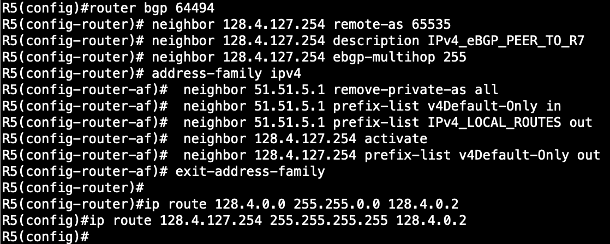
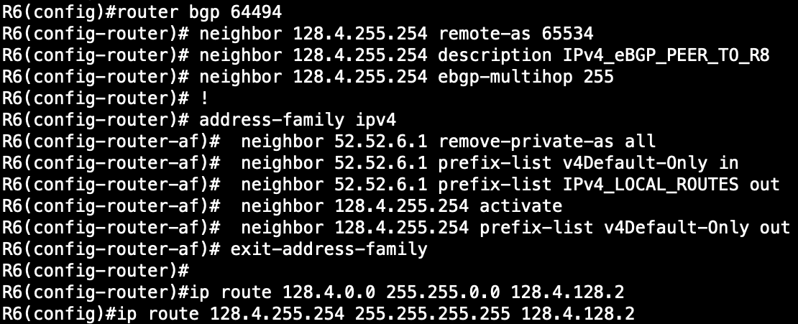
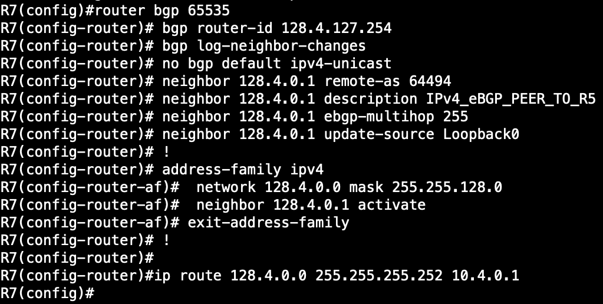
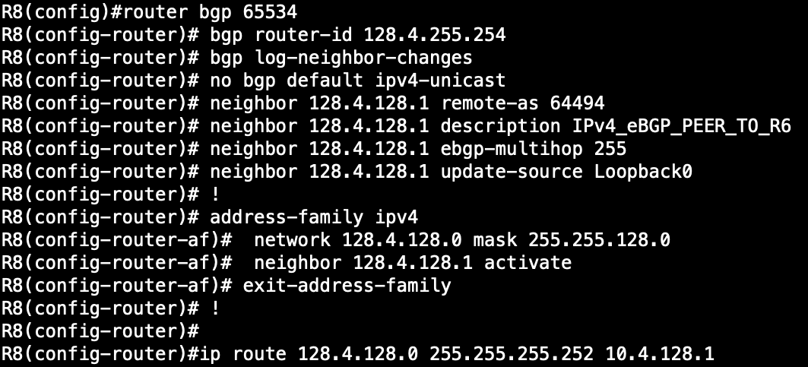
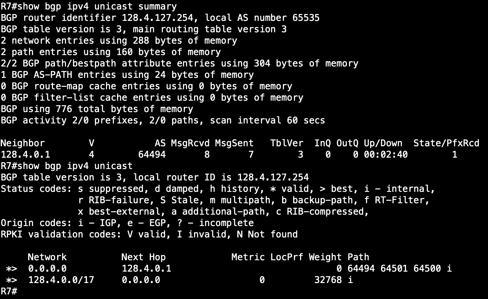
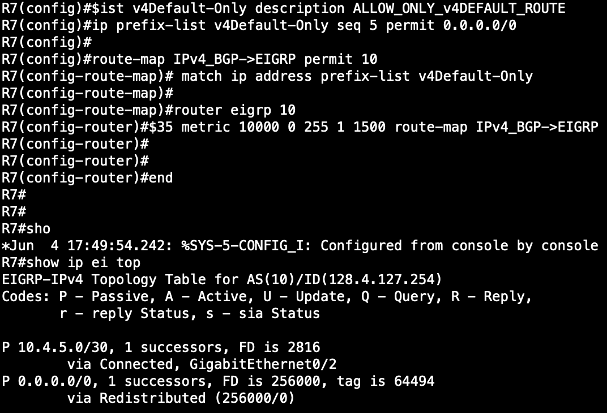
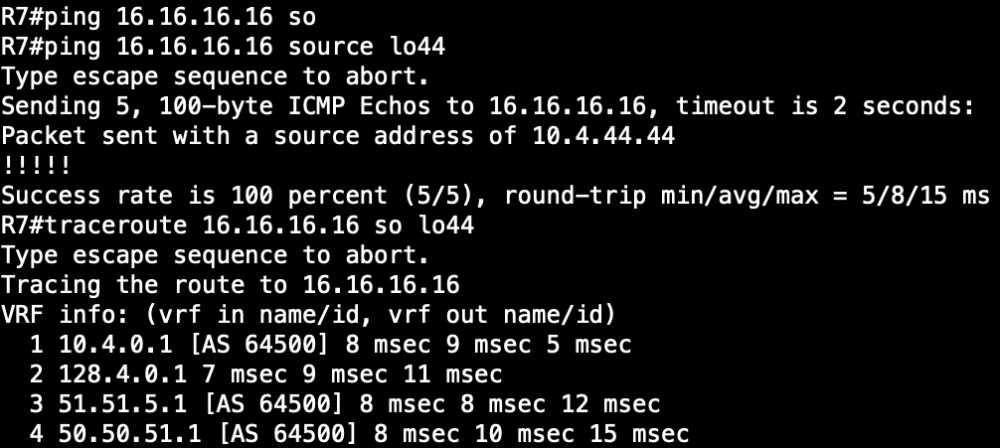
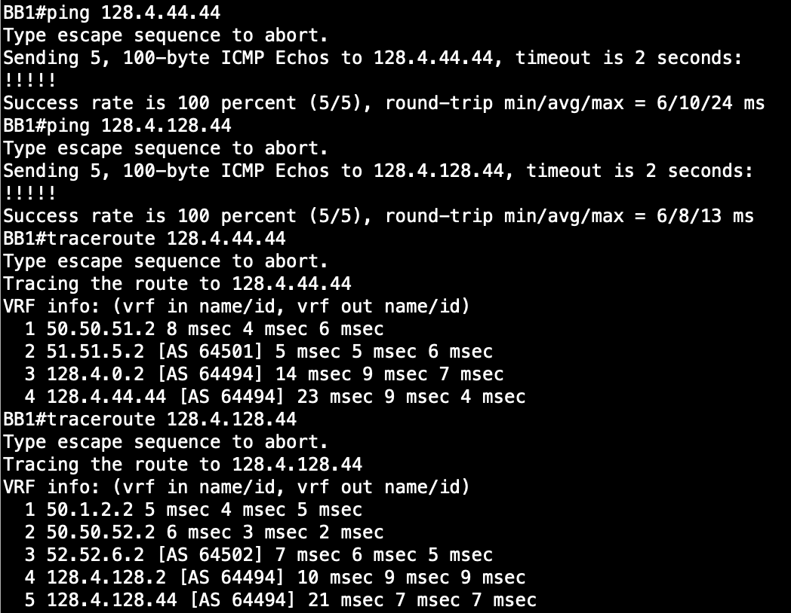

# CDS-4 Instructions

My Contact information:
> Email:    michael.zsiga@gmail.com\
> Twitter:  https://twitter.com/michael_zsiga \
> LinkedIn: https://www.linkedin.com/in/zigzag \
> Website:  https://zigbits.tech

This is Common Deployment Scenario (CDS) # 4 from the Cisco Live presentation BRKRST-2044 - Enterprise Multi-Homed Internet Edge Architectures. CDS-4 highlights the multiple routers, multiple ISP connections, and multiple sites deployment example. Within this page are the steps to properly configure BGP Active / Active routing connectivity to the Internet (INET). We are going to handle IPv4 and IPv6 separately here, so they will be discussed in their own sections.

NOTE: For all the Common Deployment Scenarios (CDS) you can load the initial configurations for BB1, BB2, ISP-A, and ISP-B once. We are not making a lot of changes to these devices, if any.

# CDS-4 Reference topology
Here is the CDS-4 Reference topology


# CDS-4 Section 1: IPv4 Solution

For our IPv4 policy we have to keep in mind that we will be utilizing network address translation on FW4 and FW5, and the state is not shared between the two sites.  Now from a symmetry of routes perspective NAT is a solution we can work with. For our Ingress policy we need to split up our network into different slices so that each firewall can own its own slide.  For IPv4, our range was 128.4.0.0/16 and we are going to break this up into two /17 slices, 128.4.0.0/17 and 128.4.128.0/17.  The West data center will own 128.4.0.0/17 and the east data center will own 128.4.128.0/17.  For our Egress policy we are going to install the default routes from each provider and propagate them down into our Campus (R7 and R8) in each location.  Once again for this CDS, we do not have administrative control over the firewalls, FW4 and FW5, so we are going to have to find a way around this to propagate the default down to the Campus routers (R7 and R8).

Make sure you have the initial configurations loaded for R5, R6, FW4, FW5, R7, and R8. Our starting configurations for our edge routers (R5 and R6) already have BGP configured to the provider without any policies applied. The campus routers (R7 and R8) have EIGRP configured to simulate a large campus network.

## Egress Policy

For us to propagate any routes between our edge routers (R5 and R6) and our campus routers (R7 and R8), we need to form some sort of routing neighborship through the firewalls (FW4 and FW5).  We could use an IGP or BGP to accomplish this. Because we have better policy control with BGP we are going to leverage eBGP neighborships between R5 and R7, and R6 and R8. On the campus routers (R7 and R8) we will be leveraging provide ASNs (65535 and 65534) for our BGP configuration.  We will want to remove these private ASNs before the networks are advertised to our providers. If you happened to notice that FW4 and FW5 are layer 3 Firewalls, we will need to leverage multi-hop BGP configurations to form these adjacencies.

eBGP Multi-hop
```
router bgp 64494
 neighbor 128.4.127.254 remote-as 65535
 neighbor 128.4.127.254 description IPv4_eBGP_PEER_TO_R7
 neighbor 128.4.127.254 ebgp-multihop 255
 address-family ipv4
  neighbor 128.4.127.254 activate
  neighbor 128.4.127.254 prefix-list v4Default-Only out
```

Remove Private ASNs from AS-PATH
Egress Policy: Only allow default
Ingress Policy: Advertise our Local subnets
```
router bgp 64494
 address-family ipv4
  neighbor 51.51.5.1 remove-private-as all
  neighbor 51.51.5.1 prefix-list v4Default-Only in
  neighbor 51.51.5.1 prefix-list IPv4_LOCAL_ROUTES out
```

Having the BGP configuration isn't going to be enough because the Firewalls will be utilizing static tragic routes, thus we must also use some static tragic routes ourselves.

Putting all of this together for R5 and R6 we get the following:

```
R5:
router bgp 64494
 neighbor 128.4.127.254 remote-as 65535
 neighbor 128.4.127.254 description IPv4_eBGP_PEER_TO_R7
 neighbor 128.4.127.254 ebgp-multihop 255
 address-family ipv4
  neighbor 51.51.5.1 remove-private-as all
  neighbor 51.51.5.1 prefix-list v4Default-Only in
  neighbor 51.51.5.1 prefix-list IPv4_LOCAL_ROUTES out
  neighbor 128.4.127.254 activate
  neighbor 128.4.127.254 prefix-list v4Default-Only out
 exit-address-family

ip route 128.4.0.0 255.255.0.0 128.4.0.2
ip route 128.4.127.254 255.255.255.255 128.4.0.2

R6:
router bgp 64494
 neighbor 128.4.255.254 remote-as 65534
 neighbor 128.4.255.254 description IPv4_eBGP_PEER_TO_R8
 neighbor 128.4.255.254 ebgp-multihop 255
 !
 address-family ipv4
  neighbor 52.52.6.1 remove-private-as all
  neighbor 52.52.6.1 prefix-list v4Default-Only in
  neighbor 52.52.6.1 prefix-list IPv4_LOCAL_ROUTES out
  neighbor 128.4.255.254 activate
  neighbor 128.4.255.254 prefix-list v4Default-Only out
 exit-address-family

ip route 128.4.0.0 255.255.0.0 128.4.128.2
ip route 128.4.255.254 255.255.255.255 128.4.128.2
```

Here are screenshots of eBGP Multi-hop being configured on R5 and R6:





Now that we have finished up our eBGP Multi-hop configuration on R5 and R6, we need to do the same eBGP Multi-hop configuration on R7 and R8.  We also cannot forget our lovely tragic routes! :)

```
R7:
router bgp 65535
 bgp router-id 128.4.127.254
 bgp log-neighbor-changes
 no bgp default ipv4-unicast
 neighbor 128.4.0.1 remote-as 64494
 neighbor 128.4.0.1 description IPv4_eBGP_PEER_TO_R5
 neighbor 128.4.0.1 ebgp-multihop 255
 neighbor 128.4.0.1 update-source Loopback0
 !
 address-family ipv4
  network 128.4.0.0 mask 255.255.128.0
  neighbor 128.4.0.1 activate
 exit-address-family
 !

ip route 128.4.0.0 255.255.255.252 10.4.0.1

R8:
router bgp 65534
 bgp router-id 128.4.255.254
 bgp log-neighbor-changes
 no bgp default ipv4-unicast
 neighbor 128.4.128.1 remote-as 64494
 neighbor 128.4.128.1 description IPv4_eBGP_PEER_TO_R6
 neighbor 128.4.128.1 ebgp-multihop 255
 neighbor 128.4.128.1 update-source Loopback0
 !
 address-family ipv4
  network 128.4.128.0 mask 255.255.128.0
  neighbor 128.4.128.1 activate
 exit-address-family
 !

ip route 128.4.128.0 255.255.255.252 10.4.128.1
```

Here are screenshots of eBGP Multi-hop being configured on R7 and R8:





Now that we have our full eBGP configuration done, we should expect to see our neighborships come up but they dont...because we need to have the security team add those static tragic routes on FW4 and FW5, so this is what they would need to add.

```
FW4:
ip route 0.0.0.0 0.0.0.0 128.4.0.1
ip route 10.4.0.0 255.255.128.0 10.4.0.2
ip route 128.4.127.254 255.255.255.255 10.4.0.2

FW5:
ip route 0.0.0.0 0.0.0.0 128.4.128.1
ip route 10.4.128.0 255.255.128.0 10.4.128.2
ip route 128.4.255.254 255.255.255.255 10.4.128.2

```

Here are screenshots showing these static routes being configured.


NOTE:You would also need to allow BGP through the Firewall ACL configuration, we are not running a full firewall configuration on FW4 and FW5 to save on resources.

Now we should do a quick verification that our eBGP neighborships are up and that we are just receiving the default route.  We do this with the following commands on R7 and R8:

```
show bgp ipv4 unicast summary
show bgp ipv4 unicast
```

Here are screenshots validating our eBGP configurations on R7 and R8.




Now all we need to do for our Egress policy is to get these default routes into the local IGP in the campus, so we will be redistributing BGP into EIGRP.  When we do this redistribution we need to make sure we increase the metric considerably as we do not want campus traffic to take a suboptimal route to the Internet.  Here are the configurations and verification commands:

```
ip prefix-list v4Default-Only description ALLOW_ONLY_v4DEFAULT_ROUTE
ip prefix-list v4Default-Only seq 5 permit 0.0.0.0/0

route-map IPv4_BGP->EIGRP permit 10
 match ip address prefix-list v4Default-Only

router eigrp 10
 redistribute bgp 65535 metric 10000 0 255 1 1500 route-map IPv4_BGP->EIGRP

show ip eigrp topology
```

Here is a screenshot showing the configuration being applied on R7, the same configuration is applied to R8 but the BGP ASN is 65534.



## Ingress Policy

We can leverage the same eBGP Multihop configuration to instantiate our Ingress policy. We need to determine where we should originate our new /17 networks (128.4.0.0/17 and 128.4.128.0/17).  We could originate them on the edge routers or on the campus routers. Because the edge routers do not have visibility of the links between the Firewalls and the campus routers, there is a failure situation where we would end up dropping traffic.  This makes the campus routers the only viable place to originate the advertisement of the /17s.

To accomplish this advertisement we can add the corresponding network statements in BGP but then we actually need to get them in the RIB on R7 and R8. We are going to do this via static tragic routes to Null 0.

Here is what this looks like.

```
R7:
router bgp 65535
 address-family ipv4
  network 128.4.0.0 mask 255.255.128.0
 exit-address-family
 !

ip route 128.4.0.0 255.255.128.0 Null0

R8:
router bgp 65534
 address-family ipv4
  network 128.4.128.0 mask 255.255.128.0
 exit-address-family
 !

ip route 128.4.128.0 255.255.128.0 Null0

```
Here are screenshots showing these configurations on R7 and R8.


## Verification

Now its time to verify everything!! We are going to utilize ping and traceroute to assist us in our verification.

West Cost Server: 128.4.44.44 (10.4.44.44)
East Cost Server: 128.4.128.44 (10.4.128.44)

Internet Web Server: 16.16.16.16

```
ping 16.16.16.16 so lo44
traceroute 16.16.16.16 so lo44

ping 128.4.44.44
ping 128.4.128.44
traceroute 128.4.44.44
traceroute 128.4.128.44

```

Here are the associated screenshots of our policy validation.







# CDS-4 Section 2: IPv6 Solution
